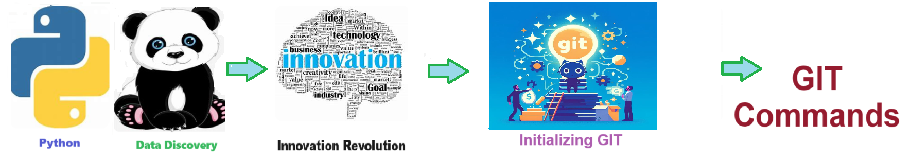
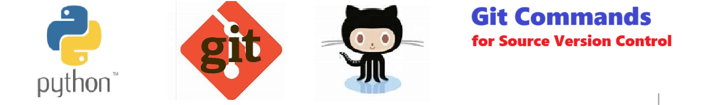

# Git Commands - Git is a distributed version control system designed to track changes in source code during software development.
Git is a distributed version control system designed to track changes in source code during software development.

Welcome to the solution **Git Commands** - an example for your projects

Git is a distributed version control system designed to track changes in source code during software development.
## instructions # Git Commands - Welcome to the **git_commands** repository! 
##This project demonstrates how to update, maintain, and archive All of your work in progress. 

NEVER LOSE YOUR WORK IN PROGRESS AGAIN!!!!. Moves files to github. 

## Description

Welcome to the solution Git Commands - an example for your projects

Welcome to the **git_commands** repository!
1. This project demonstrates how to update, maintain, and archive All of your work in progress. NEVER LOSE YOUR WORK IN PROGRESS AGAIN!!!!.
2. Moves only your **changed** files to github. 

**Git** is a distributed version control system designed to track changes in source code during software development, allowing multiple developers to collaborate, manage different versions, and merge their work seamlessly. It enables efficient code management, fosters collaboration, and ensures the integrity and history of a project's development.

**GitHub** is a web-based platform for version control using Git, enabling collaboration among software developers by allowing them to host, review, and manage code repositories. It provides tools for tracking changes, managing issues, and facilitating contributions through pull requests.

## Git command samples
- git init
- git add .
- git commit -m "first commit"
- git branch -M main
- git remote add origin {solution_name}.git
- git push -u origin main
- git remote add origin https://github.com/JoeEberle/{solution_name}//{solution_name}.git
- git branch -M main
- git push -u origin main

## Features

- Easy to understand and use  
- Easily Configurable 
- Quickly start your project with pre-built templates
- Its Fast and Automated

## Notebook Features

- Self Documenting 
- Self Testing 
- Easily Configurable
- Includes Talking Code - The code explains itself
- Self Logging 
- Self Debugging 
- Low Code - or - No Code
- Educational 

## Getting Started

To get started with the Git Commands solution, follow these steps:

1. Clone the repository to your local machine.
2. Install the required dependencies listed at the top of the notebook.
3. Explore the example code provided in the repository and experiment.
4. Run the notebook and your find your most Critical Data - EASY !

 

## Features
- Easy to understand and use  
- Easily Configurable 
- Quickly start your project with pre-built templates
- Its Fast and Automated

## Notebook Features
- **Self Documenting** - Automatically identifes major steps in notebook 
- **Self Testing** - Unit Testing for each ptyhon function
- **Easily Configurable** -easily modifyable with config.INI name value pairs
- **Includes Talking Code** - The code explains itself.
- **Self Logging** - enhanced python standard logging   
- **Self Debugging** - enhanced python standard debugging
- **Low Code - or - No Code** - Most solutions are under 50 lines of code
- **Educational** - Includes educational dialogue and background material
    
## Getting Started
To get started with the **Git Commands** solution repository, follow these steps:
1. Clone the repository to your local machine.
2. Install the required dependencies listed at the top of the notebook.
3. Explore the example code provided in the repository and experiment.
4. Run the notebook and make it your own - **EASY !**
    
## https://github.com/JoeEberle/ -- josepheberle@outlook.com 
    

       